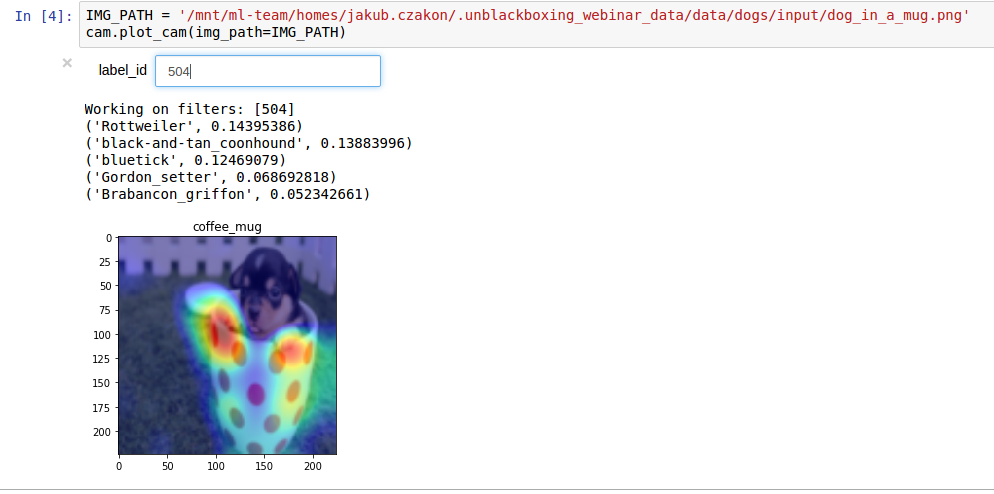
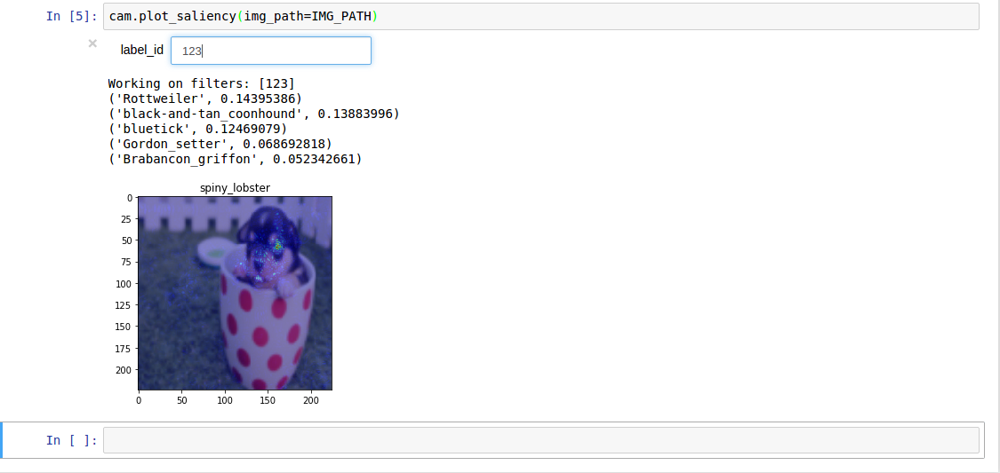
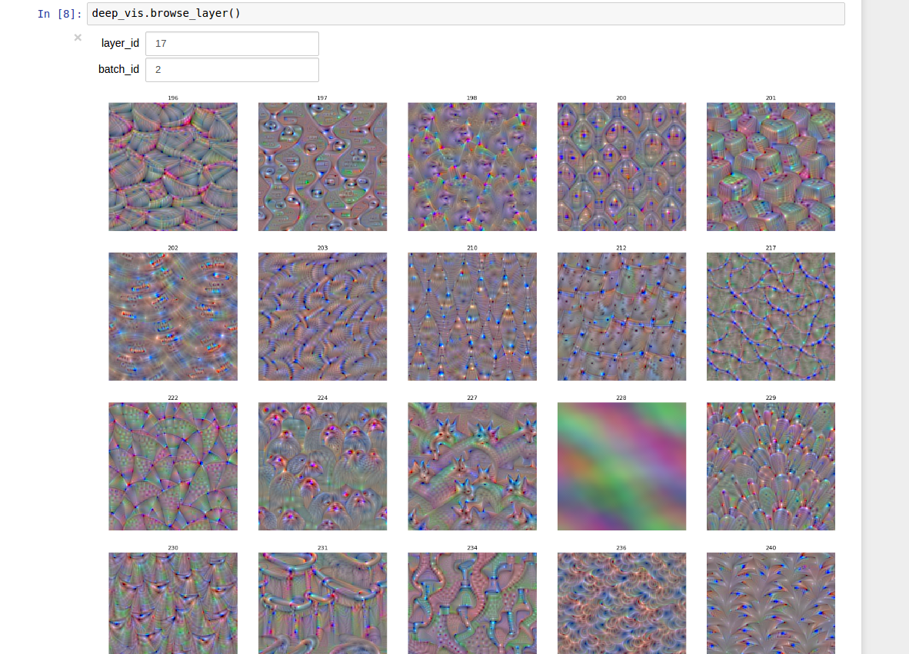
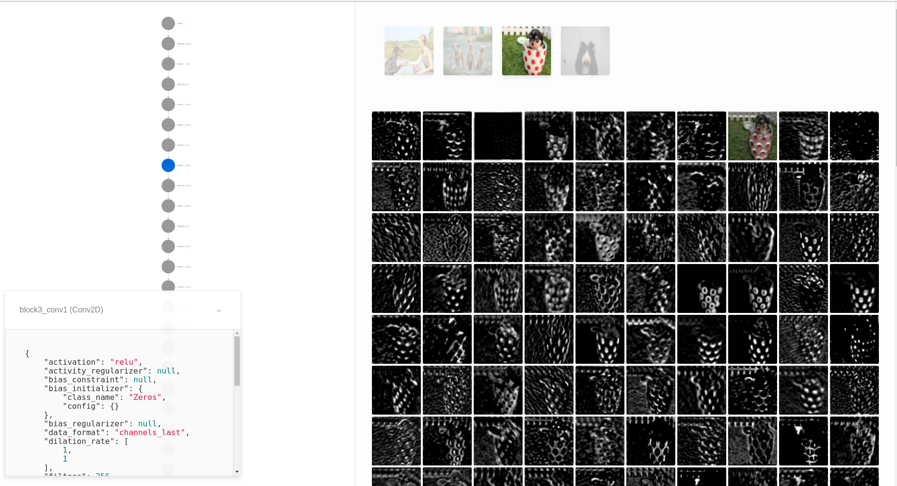
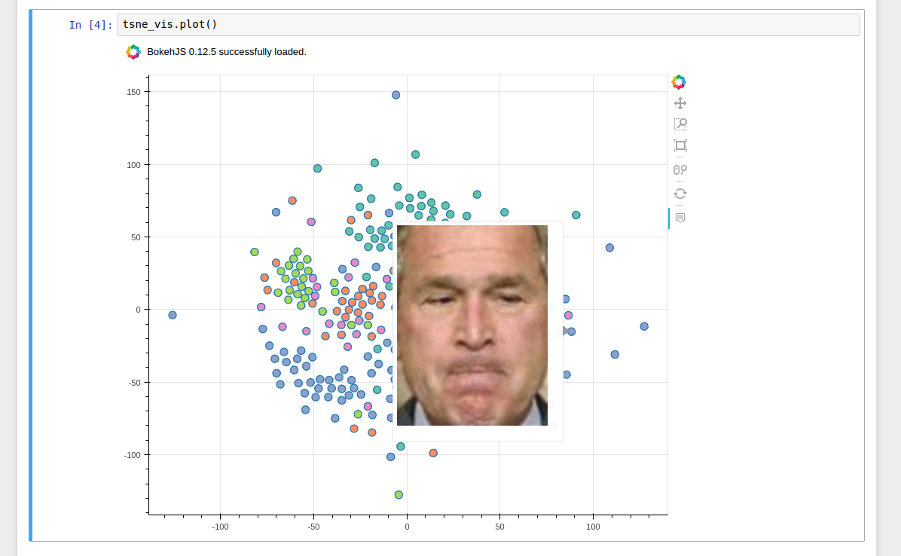
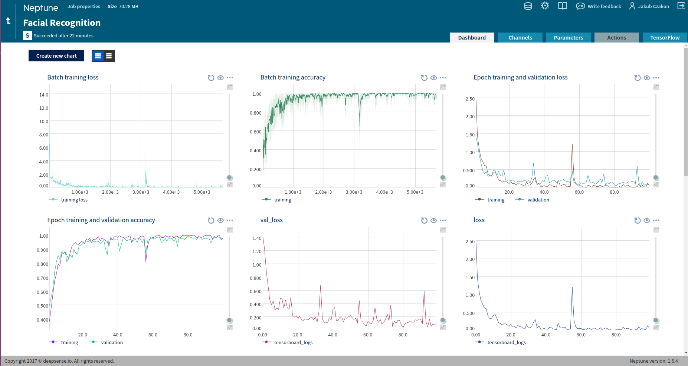
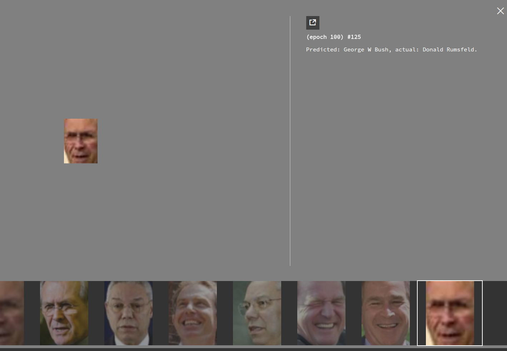
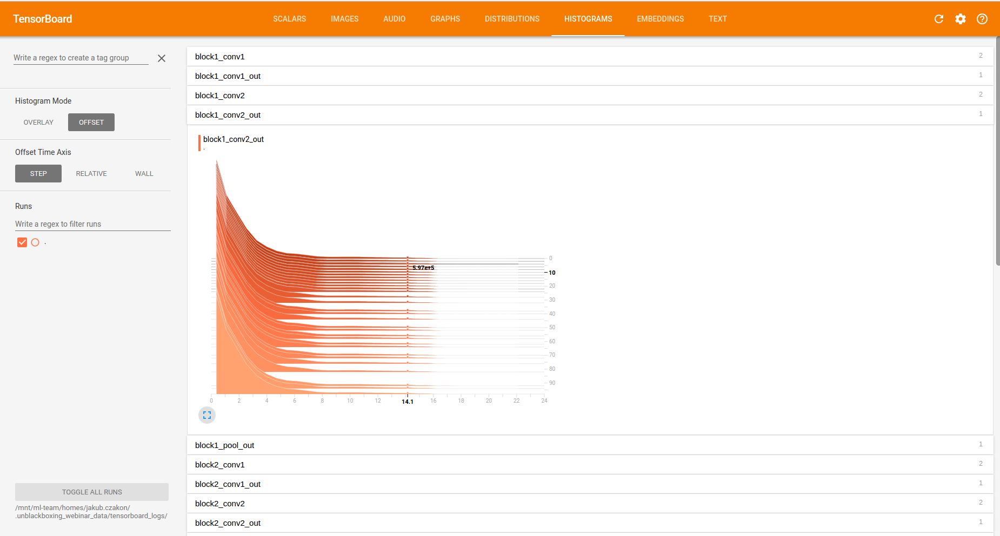
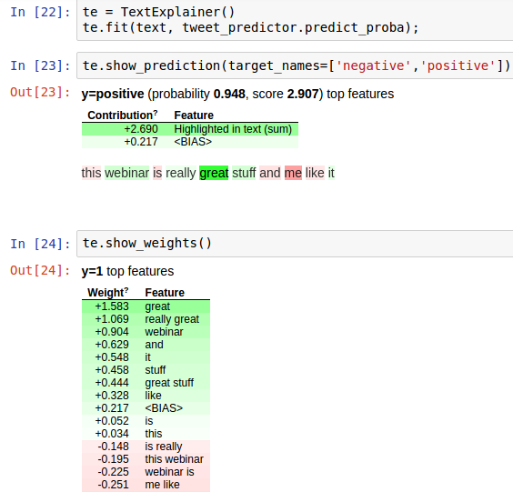
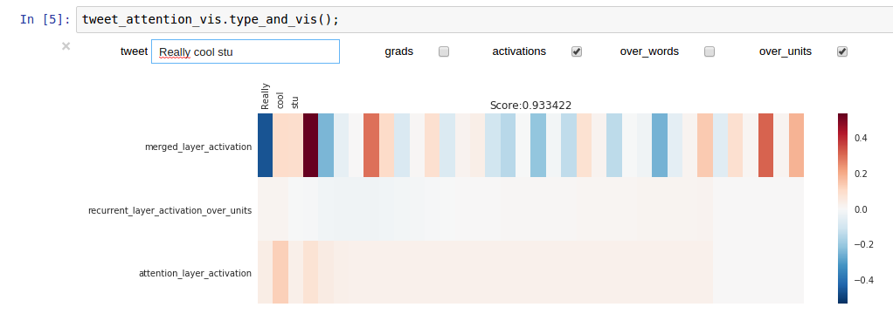

# deepsense.io webinar 

## Unblackboxing the black box webinar

## This is what it is all about

- Class Activation Maps

- Saliency Maps

- Maximal Activation Image

- Quiver

- TSNE

- Neptune

- Tensorboard

- LIME

- Attention

## Resources and Acknowledgements
Thank you all for letting the world use this!

Keras.io https://keras.io/

Keras-vis https://raghakot.github.io/keras-vis/

Neptune http://neptune.deepsense.io/versions/latest/

Eli5 http://eli5.readthedocs.io/en/latest/overview.html

LIME https://homes.cs.washington.edu/~marcotcr/blog/lime/

Quiver https://github.com/keplr-io/quiver

Tensorflow https://www.tensorflow.org/

https://jacobgil.github.io/deeplearning/class-activation-maps

https://arxiv.org/abs/1312.6034

http://blog.datadive.net/random-forest-interpretation-conditional-feature-contributions/

## This is us

